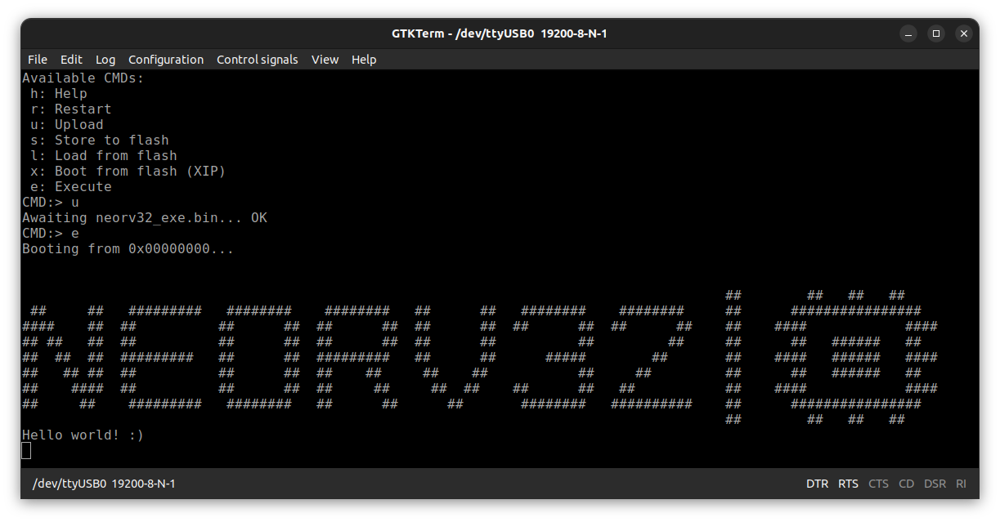

# neo
NEORV32 on ULX3S
<br><br>

## Prerequisites
Install the [RISC-V toolchain](https://github.com/riscv-collab/riscv-gnu-toolchain.git) and [oss-cad-suite](https://github.com/YosysHQ/oss-cad-suite-build#installation) tools.
<br>
The script below is for linux installation only.
<br>
```bash
#For RISC-V
mkdir risc-v
cd risc-v
git clone https://github.com/riscv/riscv-gnu-toolchain
mkdir /opt/riscv
./configure --prefix=/opt/riscv
make linux
export PATH="$PATH:/opt/riscv/bin" >> ~/.bashrc
source ~/.bashrc

#For OSS-CAD-SUITE
mkdir /opt/oss-cad-suite
curl https://github.com/YosysHQ/oss-cad-suite-build/releases/download/2023-10-01/oss-cad-suite-linux-riscv64-20231001.tgz
tar xvzf oss-cad-suite-linux-riscv64-20231001.tgz -C /opt/oss-cad-suite
export PATH="$PATH:/opt/oss-cad-suite/bin" >> ~/.bashrc
source ~/.bashrc
```

## Test
Plug the USB1 of ULX3S Board to your PC, then run:
```bash
git clone https://github.com/fedy0/neo.git && cd neo
make flash
```

